# Fraut App

A modern Kotlin Multiplatform app for Autistic Parents and Families.

This repository is a showcase of the app's UI and features.

## 📱 Screenshots

### 🌟 Features

  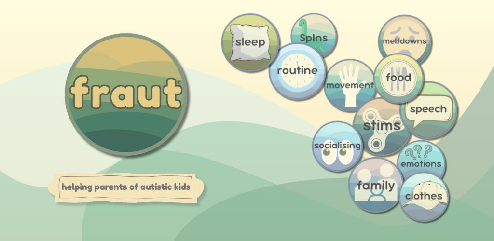

### 🤖 Android Phones

  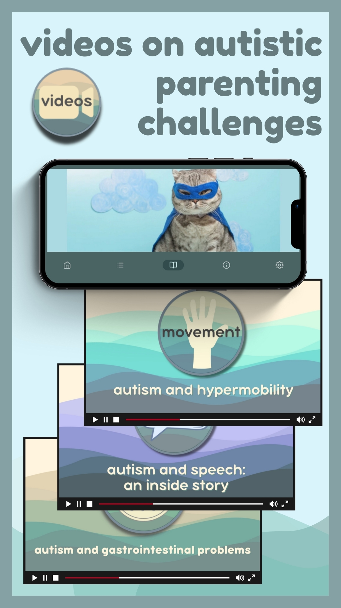
  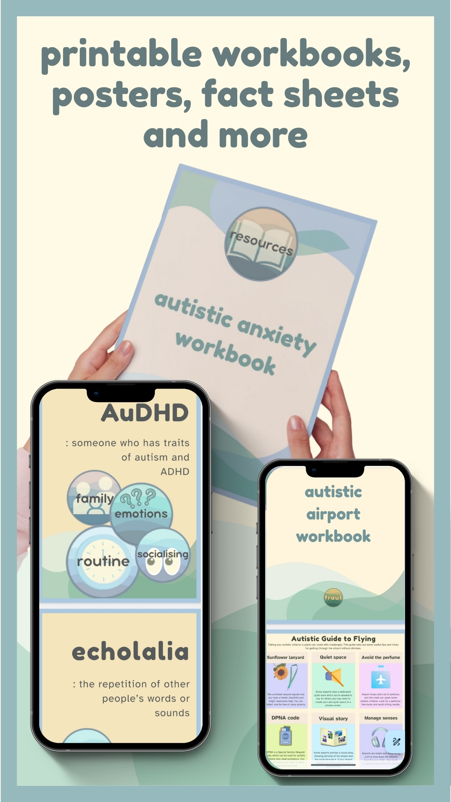

### 📱 Android Tablets

  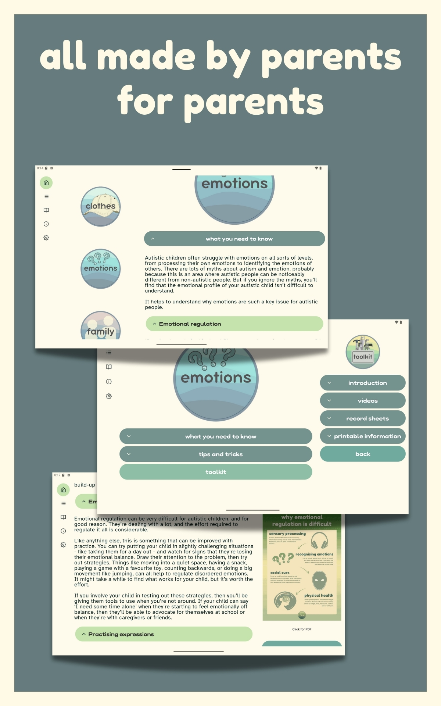
  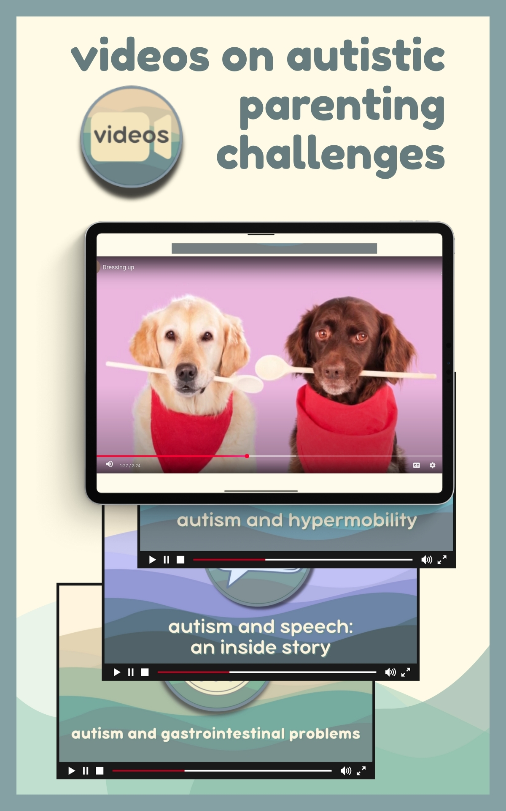
  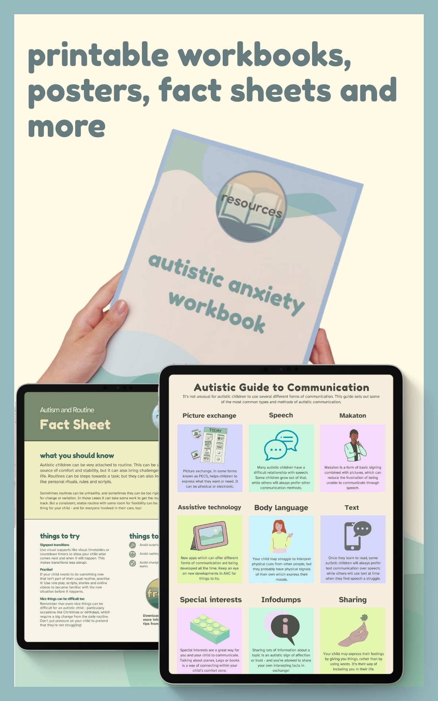

### 🍏 iPhone

  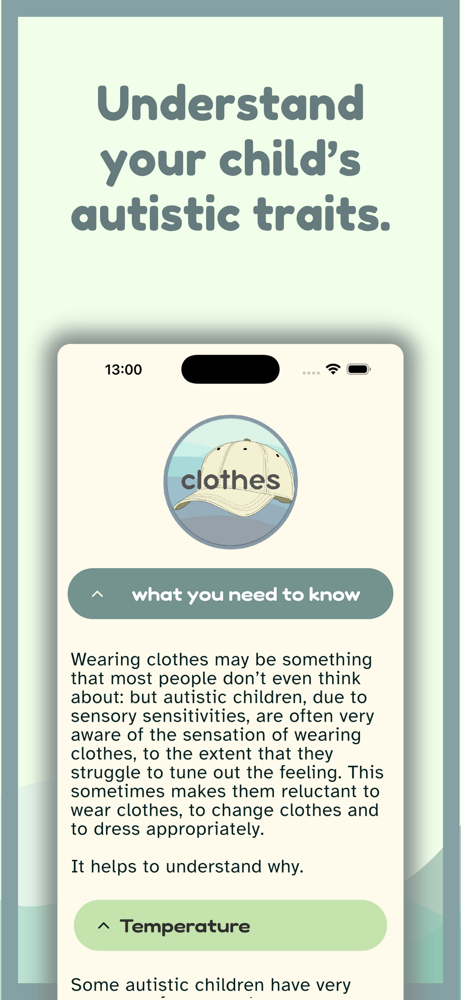
  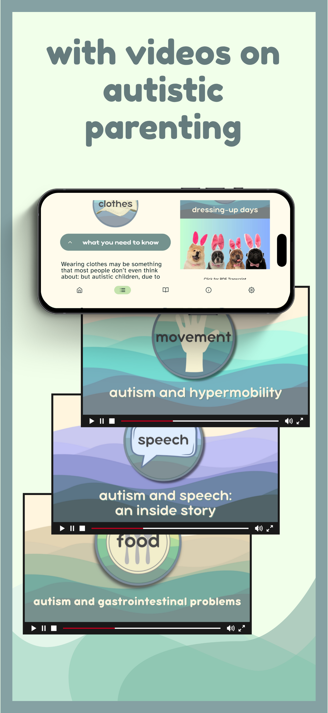
  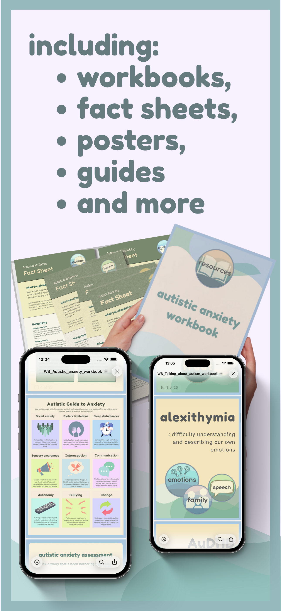

### 🍎 iPad

  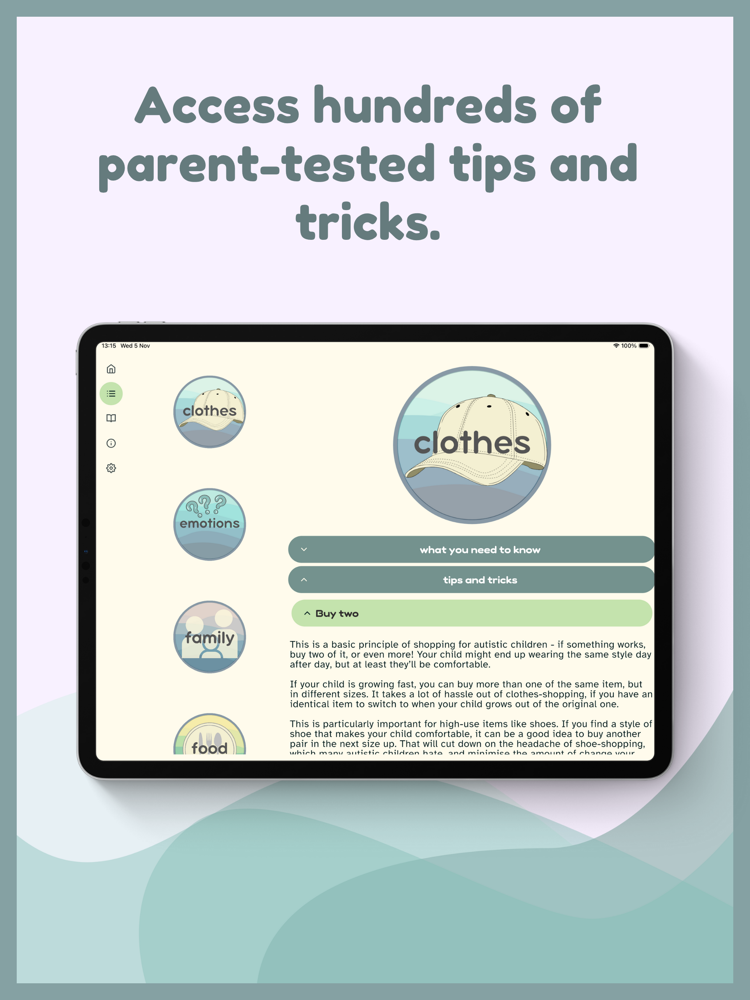
  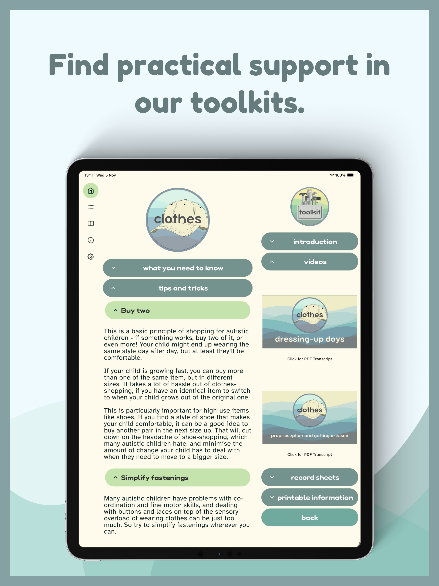
  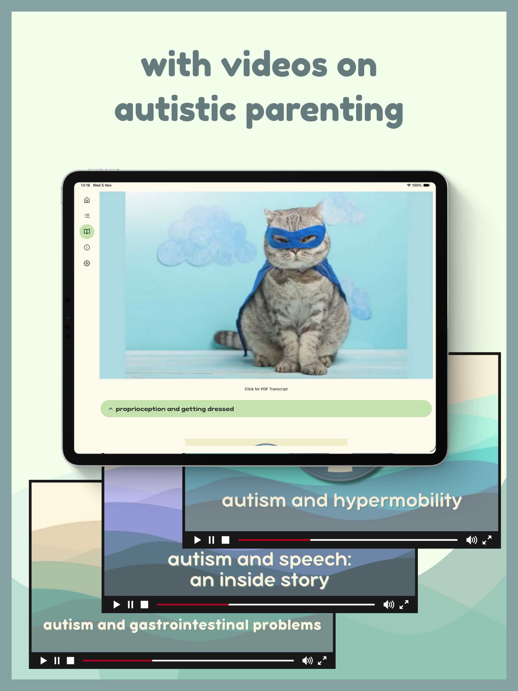
  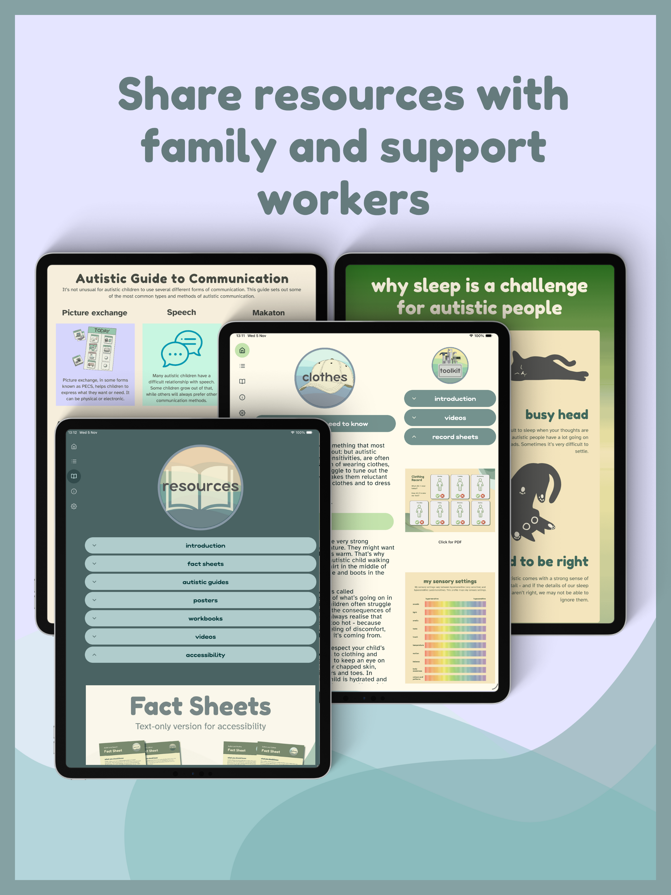

## 📝 About

This is a commercial application.  
**Source code is private and not included.**  
This repository is purely for promotional and informational purposes.

Please read more on [www.fraut.co.uk](https://www.fraut.co.uk).

App is currently available on [Google Play Store](https://play.google.com/store/apps/details?id=uk.co.fraut.android&utm_source=emea_Med).

